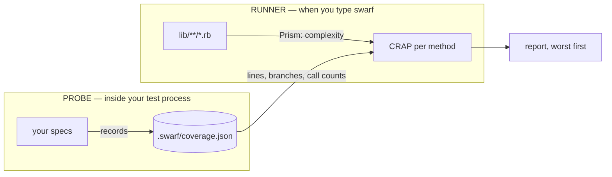

# swarf

Scores every Ruby method by how complex it is against how well your tests actually exercise it.

```
$ swarf lib/

Method                       CC    Cov%   CRAP      Evidence
------------------------------------------------------------
Cart#checkout                 6    0.0%  42.00  never called
Cart#discount                 4   50.0%   6.00        3/6 br
Cart#shipping                 3   66.7%   3.33        2/3 br
Cart#subtotal                 1  100.0%   1.00        1/1 ln
```

## The metric

```
CRAP(m) = CC² · (1 − coverage)³ + CC
```

Complexity is squared; the _uncovered_ fraction is cubed. Two identities explain the shape:

| coverage | CRAP       | meaning                                             |
| -------- | ---------- | --------------------------------------------------- |
| 100%     | `CC`       | fully tested code is only as risky as it is complex |
| 0%       | `CC² + CC` | untested complexity grows quadratically             |

The curve is nearly flat near full coverage and violently steep near zero, which is the
point: simple code and small gaps stay quiet, complex code nobody has run scores loudly.

From Alberto Savoia and Bob Evans (2007), where it stood for _Change Risk Analysis and
Prediction_; Robert C. Martin's ports expand it as _Change Risk Anti-Pattern_. Same formula.

## Install

```ruby
# Gemfile
gem "swarf", group: :development
```

```
$ bundle install
```

## Getting started

### 1. Score complexity — no setup at all

Complexity is parsed straight from your source, so this works immediately:

```
$ bundle exec swarf lib/

Method                    CC  Cov%   CRAP  Evidence
---------------------------------------------------
Cart#checkout              6     —  42.00   no data
Cart#discount              4     —  20.00   no data
Cart#shipping              3     —  12.00   no data
Cart#subtotal              1     —   2.00   no data
```

`no data` means no test run has been recorded yet, so every method reports `CC² + CC`.
That is not a placeholder — it is the correct score for code nothing has run. Adding
coverage can only ever pull a number _down_, toward `CC`.

### 2. Record coverage — one line

Load the probe **before anything else** in your test runs.

**RSpec** — add to `.rspec`, above every other line:

```
--require swarf/probe
```

**Minitest** — the very first line of `test/test_helper.rb`, above `minitest/autorun`:

```ruby
require "swarf/probe"
```

**Anything else** — set it on the command line, no files to edit:

```
$ RUBYOPT="-rswarf/probe" bundle exec rake test
```

Order matters and is not negotiable: `Coverage` measures only files loaded _after_ it
starts. Put the probe under your application and the application is invisible to it.

Then ignore the store:

```
# .gitignore
.swarf/
```

### 3. Run your tests, then score again

```
$ bundle exec rspec
$ bundle exec swarf lib/

Method                    CC    Cov%   CRAP      Evidence
----------------------------------------------------------
Cart#checkout              6    0.0%  42.00  never called
Cart#discount              4   50.0%   6.00        3/6 br
Cart#shipping              3   66.7%   3.33        2/3 br
Cart#subtotal              1  100.0%   1.00        1/1 ln
```

Every run merges into `.swarf/coverage.json`, so partial runs are fine — running one spec
file does not erase what another proved. Your runs, CI's runs and a colleague's all add up.

## Reading the report

| column     | means                                                             |
| ---------- | ----------------------------------------------------------------- |
| `CC`       | cyclomatic complexity — how many decisions the method makes       |
| `Cov%`     | how much of it your tests exercised, or `—` when nothing is known |
| `CRAP`     | the score; worst first                                            |
| `Evidence` | where the coverage number came from, so you know what to do next  |

The evidence column is the actionable half:

| evidence       | what it means                               | what to do                           |
| -------------- | ------------------------------------------- | ------------------------------------ |
| `never called` | no test has ever executed this method       | **write** a test                     |
| `3/6 br`       | 3 of 6 branch outcomes were taken           | **extend** a test to the other cases |
| `1/1 ln`       | no branches, so lines are the whole truth   | nothing, if it is 100%               |
| `no data`      | no test run has been recorded for this file | run your suite with the probe loaded |
| `stale`        | the file changed since it was measured      | re-run your suite                    |

Both `no data` and `stale` fall back to the `CRAP = CC² + CC` floor rather than guessing.

## Command line

```
$ swarf                       # the whole project
$ swarf lib/ app/             # directories, recursively
$ swarf lib/app/cart.rb       # a single file
$ swarf --version
$ swarf --help
```

Directories are searched for `**/*.rb`, skipping `test/`, `spec/`, `vendor/`, `tmp/` and
`node_modules/`. Naming one of those directly still scores it.

`SWARF_DIR` moves the coverage store, which both the probe and the runner must agree on:

```
$ SWARF_DIR=/tmp/swarf bundle exec rspec
$ SWARF_DIR=/tmp/swarf bundle exec swarf lib/
```

## How it works

Two halves that never talk to each other, joined by a file on disk.



The probe is about thirty lines: `Coverage.start` plus an `at_exit` that dumps the result.
The runner never loads your application — it parses text.

## Things worth knowing

**Coverage needs a run; complexity does not.** Nothing static can tell you whether a line
executed. Any run counts, not just specs — a rake task, booting the app, a script.

**The probe must load first.** `Coverage` only measures files loaded after it starts. Put
it ahead of your application, or the application is invisible to it.

**swarf and SimpleCov cannot both run.** Ruby permits one `Coverage.start` per process. If
SimpleCov gets there first, swarf warns and records nothing rather than killing your suite.

**Branch coverage is preferred, with a line fallback.** Ruby puts a decision on a line that
runs whichever way the decision goes, so `return 0 if x.negative?` reads 100% by line even
when the guard never fires — maximally wrong exactly where risk collects. Methods with no
branches fall back to lines, where "did it run" is the whole truth.

**`never called` is a fact, not an inference.** It comes from a VM-level call count. It
tells you to _write_ a test; `3/6 br` tells you to _extend_ one. A bare `0.0%` tells you
neither.

**Edited files report `no coverage`, not stale numbers.** Coverage is indexed by line
number, so inserting a method at the top of a file shifts every line below it while the
counters stay put. swarf stores a SHA-256 per measured file and drops entries whose bytes
changed, because stale coverage is worse than none — it is confidently wrong.

**swarf's CC will not match RuboCop's.** It counts `if`, `unless`, `while`, `until`, `for`,
each `when`, each `in`, each `rescue`, `&&`, `||` and `&.` — **not blocks**. Six chained
`add_option` blocks are not six decisions. The trade-off is that CC largely ignores
iteration, since Ruby iterates with blocks.

**There is no threshold and nothing fails.** swarf sorts worst-first and prints. Because
`CRAP = CC` at full coverage, a fixed threshold is a complexity cap in disguise — a method
at CC 9 can never score under 9 however well you test it, and the only remaining move is to
split it. Ranking is enough; capping complexity is RuboCop's job.

## Known limitations

- Methods defined inside a `Struct.new do ... end` block take the enclosing module's name
  (`Swarf#crap` rather than `Swarf::Score#crap`), because the block is not a class node.
- `define_method` and other dynamically defined methods are not seen at all — swarf reads
  `def`.
- Nested `def`s get their own complexity, but the outer method's coverage still counts the
  inner method's lines and branches.
- Methods inside `class << self` are named correctly; methods defined by `instance_eval` or
  a reopened singleton via a variable are not.
- No file locking, so parallel test processes writing at once can lose a partial result.
- No ignore patterns for generated code, config or migrations.

## Development

```
$ bin/setup
$ bundle exec rake test
```

To watch swarf score itself:

```
$ RUBYOPT="-Ilib -rswarf/probe" bundle exec rake test
$ ruby -Ilib exe/swarf lib/
```
